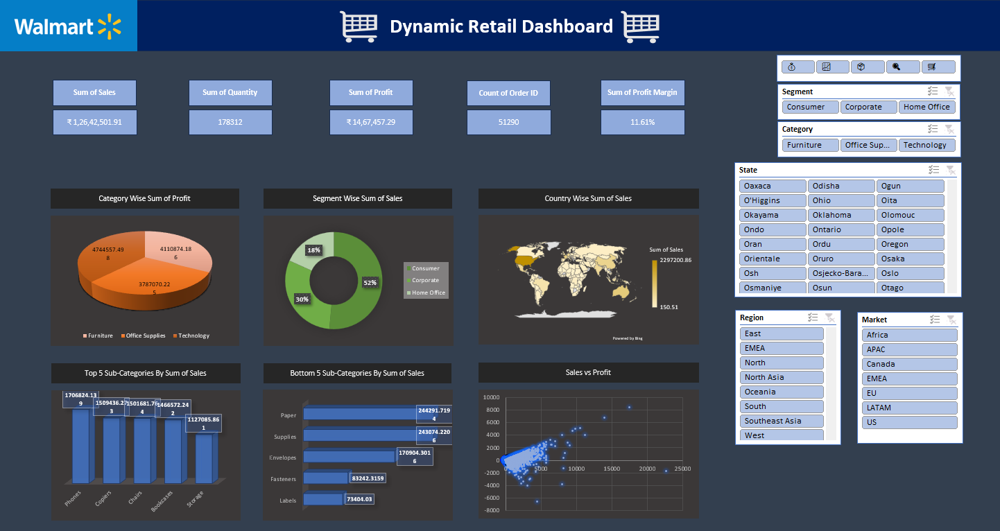

**Sales Analytics Dashboard**

**Project Overview**
This project presents a dynamic Excel dashboard built to analyze sales data and generate meaningful business insights. The dashboard helps visualize key performance metrics such as sales, profit, regional performance, and return patterns.

**Dataset Description**
The dataset consists of multiple structured sheets:
- Orders → Transactional sales records
- Returns → Returned orders tracking
- People → Regional manager mapping

**Tools & Features Used**
- Microsoft Excel
- Pivot Tables
- Charts & Graphs
- KPI Metrics
- Data Filtering
- Data Cleaning

**Key Insights Generated**
- Regional sales performance comparison
- Profit trends analysis
- Category-wise sales distribution
- Return pattern identification

**Objective**
To transform raw sales data into a structured analytical dashboard that supports business decision-making and performance evaluation.

**Skills Demonstrated**
- Data Analysis
- Data Visualization
- Business Intelligence Thinking
- Reporting & Dashboard Design
